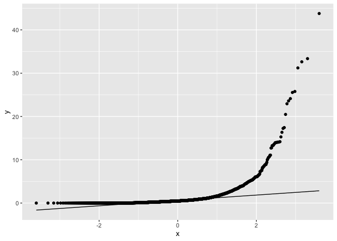

Geog4/6300: Final Project
================

{Your name: Nick Taborsak}

## Research question:

*A brief explanation of the question you’re trying to answer.*

{How did association between the presidential vote (measured by vote for
the Democratic candidate) and ethnicity change between 2008 and 2016?}

## Data

*The data you’re using for this assignment, including the source of the
data (if known) and the main variables of interest*

{Data:

<https://github.com/tonmcg/US_County_Level_Election_Results_08-20> , Lab
5 data: elections0816_demog_pct.csv Variables of interest: dem_pct,
wht_pop_pct, afam_pop_pct, asn_pop_pct, hisp_pop_pct, other_pop_pct

County shapefile from Lab 6 data}

``` r
election_data<-read_csv("data/elections0816_demog_pct.csv")
```

    ## Rows: 9334 Columns: 61
    ## ── Column specification ────────────────────────────────────────────────────────
    ## Delimiter: ","
    ## chr  (6): fips_code, gisjn_cty, county, state, region, division
    ## dbl (55): year, total, dem, gop, oth, totpop, wht_pop, afam_pop, asn_pop, hi...
    ## 
    ## ℹ Use `spec()` to retrieve the full column specification for this data.
    ## ℹ Specify the column types or set `show_col_types = FALSE` to quiet this message.

## Methods

*A description of the methods you’re using to answer your research
question, with an explanation of why these particular techniques are
most appropriate*

{Methods:

Measure the correlation between dem_pct and ethnicity variables Assess
normality of variables to determine appropriate tests needed Use rcorr
function to analyze correlation of variables - conducts correlation
analysis Use ggcorrplot to create visualization of correlation matrices
Use tmap and sf packages to create visualizations to assess spatial
distributions}

## Analysis

*The actual tests/graphs described in the methods section. Be sure that
the output of your test is visible on the knitted document, and explain
what the results of each test or the patterns visible on each graphic
mean.*

``` r
# Subset data into separate data frames by election year

election_2008<-election_data %>%
  filter(year=="2008") %>%
  na.omit(election_2008) %>%
  select(dem_pct | wht_pop_pct | afam_pop_pct | asn_pop_pct | hisp_pop_pct | other_pop_pct)
kable(head(election_2008))
```

|  dem_pct | wht_pop_pct | afam_pop_pct | asn_pop_pct | hisp_pop_pct | other_pop_pct |
|---------:|------------:|-------------:|------------:|-------------:|--------------:|
| 52.31851 |    94.30794 |    0.1550678 |   0.4545090 |    0.9464481 |      4.136032 |
| 12.34076 |    67.80609 |    0.4661280 |   1.6780609 |   27.4083282 |      2.641392 |
| 25.89697 |    90.66734 |    5.8658226 |   0.1493818 |    1.8295569 |      1.487902 |
| 52.19370 |    10.55844 |    2.5397543 |   0.2185545 |   85.1232195 |      1.560027 |
| 24.31265 |    97.13983 |    0.0000000 |   0.0000000 |    0.9110169 |      1.949153 |
| 31.28507 |    92.08244 |    2.9282393 |   0.4272967 |    1.8348624 |      2.727158 |

``` r
election_2016<-election_data %>%
  filter(year=="2016") %>%
  na.omit(election_2016) %>%
  select(dem_pct | wht_pop_pct | afam_pop_pct | asn_pop_pct | hisp_pop_pct | other_pop_pct)
kable(head(election_2016))
```

|  dem_pct | wht_pop_pct | afam_pop_pct | asn_pop_pct | hisp_pop_pct | other_pop_pct |
|---------:|------------:|-------------:|------------:|-------------:|--------------:|
| 34.82428 |    93.05057 |    0.2928986 |   0.4227687 |     1.273833 |     4.9599337 |
| 10.21180 |    64.91784 |    0.5188815 |   0.2594408 |    30.296916 |     4.0069184 |
| 15.34042 |    89.11820 |    6.1308979 |   0.4791218 |     2.395609 |     1.8761726 |
| 52.10427 |    20.60826 |    2.0628099 |   1.5074380 |    75.054546 |     0.7669421 |
| 15.77909 |    93.76068 |    0.0000000 |   0.0000000 |     3.141026 |     3.0982906 |
| 17.34997 |    90.30507 |    5.4550155 |   0.0904860 |     2.779214 |     1.3702172 |

``` r
#Assessing normality of variables of interest 

hist(election_2008$dem_pct)
```

<!-- -->

``` r
hist(election_2008$wht_pop_pct)
```

<!-- -->

``` r
hist(election_2008$afam_pop_pct)
```

<!-- -->

``` r
hist(election_2008$asn_pop_pct)
```

<!-- -->

``` r
hist(election_2008$hisp_pop_pct)
```

<!-- -->

``` r
hist(election_2008$other_pop_pct)
```

<!-- -->

``` r
hist(election_2016$dem_pct)
```

<!-- -->

``` r
hist(election_2016$wht_pop_pct)
```

<!-- -->

``` r
hist(election_2016$afam_pop_pct)
```

<!-- -->

``` r
hist(election_2016$asn_pop_pct)
```

<!-- -->

``` r
hist(election_2016$hisp_pop_pct)
```

<!-- -->

``` r
hist(election_2016$other_pop_pct)
```

<!-- -->

``` r
ggplot(election_2008,aes(sample=dem_pct)) +
  stat_qq()+
  stat_qq_line()
```

<!-- -->

``` r
ggplot(election_2008,aes(sample=wht_pop_pct)) +
  stat_qq()+
  stat_qq_line()
```

<!-- -->

``` r
ggplot(election_2008,aes(sample=afam_pop_pct)) +
  stat_qq()+
  stat_qq_line()
```

<!-- -->

``` r
ggplot(election_2008,aes(sample=asn_pop_pct)) +
  stat_qq()+
  stat_qq_line()
```

<!-- -->

``` r
ggplot(election_2008,aes(sample=hisp_pop_pct)) +
  stat_qq()+
  stat_qq_line()
```

<!-- -->

``` r
ggplot(election_2008,aes(sample=other_pop_pct)) +
  stat_qq()+
  stat_qq_line()
```

<!-- -->

``` r
ggplot(election_2016,aes(sample=dem_pct)) +
  stat_qq()+
  stat_qq_line()
```

<!-- -->

``` r
ggplot(election_2016,aes(sample=wht_pop_pct)) +
  stat_qq()+
  stat_qq_line()
```

<!-- -->

``` r
ggplot(election_2016,aes(sample=afam_pop_pct)) +
  stat_qq()+
  stat_qq_line()
```

<!-- -->

``` r
ggplot(election_2016,aes(sample=asn_pop_pct)) +
  stat_qq()+
  stat_qq_line()
```

<!-- -->

``` r
ggplot(election_2016,aes(sample=hisp_pop_pct)) +
  stat_qq()+
  stat_qq_line()
```

<!-- -->

``` r
ggplot(election_2016,aes(sample=other_pop_pct)) +
  stat_qq()+
  stat_qq_line()
```

<!-- -->
{The variables of interest do not follow a bell-shaped curve in the
histograms, nor the line of normativity along the dot plots. Thus, a
non-parametric test (Spearman’s) is needed to further my analysis.}

``` r
#Conducting Spearman's test to assess correlation 

election_2008 %>% mutate_if(is.character, as.factor)
```

    ## # A tibble: 3,111 × 6
    ##    dem_pct wht_pop_pct afam_pop_pct asn_pop_pct hisp_pop_pct other_pop_pct
    ##      <dbl>       <dbl>        <dbl>       <dbl>        <dbl>         <dbl>
    ##  1    52.3        94.3        0.155       0.455        0.946         4.14 
    ##  2    12.3        67.8        0.466       1.68        27.4           2.64 
    ##  3    25.9        90.7        5.87        0.149        1.83          1.49 
    ##  4    52.2        10.6        2.54        0.219       85.1           1.56 
    ##  5    24.3        97.1        0           0            0.911         1.95 
    ##  6    31.3        92.1        2.93        0.427        1.83          2.73 
    ##  7    56.7        63.3       20.3         5.11         9.09          2.13 
    ##  8    54.1        58.0       33.7         1.44         5.09          1.76 
    ##  9    21.7        81.0        0.860       0.456       15.8           1.92 
    ## 10    21.0        95.6        0.717       0.619        2.55          0.562
    ## # … with 3,101 more rows

``` r
election_2016 %>% mutate_if(is.character, as.factor)
```

    ## # A tibble: 3,110 × 6
    ##    dem_pct wht_pop_pct afam_pop_pct asn_pop_pct hisp_pop_pct other_pop_pct
    ##      <dbl>       <dbl>        <dbl>       <dbl>        <dbl>         <dbl>
    ##  1    34.8        93.1        0.293      0.423          1.27         4.96 
    ##  2    10.2        64.9        0.519      0.259         30.3          4.01 
    ##  3    15.3        89.1        6.13       0.479          2.40         1.88 
    ##  4    52.1        20.6        2.06       1.51          75.1          0.767
    ##  5    15.8        93.8        0          0              3.14         3.10 
    ##  6    17.3        90.3        5.46       0.0905         2.78         1.37 
    ##  7    58.4        60.3       19.8        6.67          10.1          3.13 
    ##  8    52.3        54.7       34.5        1.72           6.15         2.92 
    ##  9    13.8        77.1        1.17       0.435         19.0          2.21 
    ## 10    13.4        93.8        0.766      0.512          3.70         1.27 
    ## # … with 3,100 more rows

``` r
election_2016_cor<-rcorr(as.matrix(election_2016), type="spearman")
election_2008_cor<-rcorr(as.matrix(election_2008), type="spearman")

rcorr(as.matrix(election_2008), type="spearman")
```

    ##               dem_pct wht_pop_pct afam_pop_pct asn_pop_pct hisp_pop_pct
    ## dem_pct          1.00       -0.21         0.21        0.30        -0.03
    ## wht_pop_pct     -0.21        1.00        -0.66       -0.31        -0.60
    ## afam_pop_pct     0.21       -0.66         1.00        0.26         0.16
    ## asn_pop_pct      0.30       -0.31         0.26        1.00         0.41
    ## hisp_pop_pct    -0.03       -0.60         0.16        0.41         1.00
    ## other_pop_pct    0.07       -0.23        -0.06        0.29         0.26
    ##               other_pop_pct
    ## dem_pct                0.07
    ## wht_pop_pct           -0.23
    ## afam_pop_pct          -0.06
    ## asn_pop_pct            0.29
    ## hisp_pop_pct           0.26
    ## other_pop_pct          1.00
    ## 
    ## n= 3111 
    ## 
    ## 
    ## P
    ##               dem_pct wht_pop_pct afam_pop_pct asn_pop_pct hisp_pop_pct
    ## dem_pct               0.0000      0.0000       0.0000      0.0704      
    ## wht_pop_pct   0.0000              0.0000       0.0000      0.0000      
    ## afam_pop_pct  0.0000  0.0000                   0.0000      0.0000      
    ## asn_pop_pct   0.0000  0.0000      0.0000                   0.0000      
    ## hisp_pop_pct  0.0704  0.0000      0.0000       0.0000                  
    ## other_pop_pct 0.0001  0.0000      0.0016       0.0000      0.0000      
    ##               other_pop_pct
    ## dem_pct       0.0001       
    ## wht_pop_pct   0.0000       
    ## afam_pop_pct  0.0016       
    ## asn_pop_pct   0.0000       
    ## hisp_pop_pct  0.0000       
    ## other_pop_pct

``` r
rcorr(as.matrix(election_2016), type="spearman")
```

    ##               dem_pct wht_pop_pct afam_pop_pct asn_pop_pct hisp_pop_pct
    ## dem_pct          1.00       -0.47         0.43        0.46         0.13
    ## wht_pop_pct     -0.47        1.00        -0.62       -0.30        -0.62
    ## afam_pop_pct     0.43       -0.62         1.00        0.28         0.11
    ## asn_pop_pct      0.46       -0.30         0.28        1.00         0.35
    ## hisp_pop_pct     0.13       -0.62         0.11        0.35         1.00
    ## other_pop_pct    0.14       -0.23         0.00        0.28         0.23
    ##               other_pop_pct
    ## dem_pct                0.14
    ## wht_pop_pct           -0.23
    ## afam_pop_pct           0.00
    ## asn_pop_pct            0.28
    ## hisp_pop_pct           0.23
    ## other_pop_pct          1.00
    ## 
    ## n= 3110 
    ## 
    ## 
    ## P
    ##               dem_pct wht_pop_pct afam_pop_pct asn_pop_pct hisp_pop_pct
    ## dem_pct               0.0000      0.0000       0.0000      0.0000      
    ## wht_pop_pct   0.0000              0.0000       0.0000      0.0000      
    ## afam_pop_pct  0.0000  0.0000                   0.0000      0.0000      
    ## asn_pop_pct   0.0000  0.0000      0.0000                   0.0000      
    ## hisp_pop_pct  0.0000  0.0000      0.0000       0.0000                  
    ## other_pop_pct 0.0000  0.0000      0.8369       0.0000      0.0000      
    ##               other_pop_pct
    ## dem_pct       0.0000       
    ## wht_pop_pct   0.0000       
    ## afam_pop_pct  0.8369       
    ## asn_pop_pct   0.0000       
    ## hisp_pop_pct  0.0000       
    ## other_pop_pct

{For 2008, there is a weak positive correlation between dem_pct and
ethnicity variables afam_pop_pct (0.21), asn_pop_pct (0.30), and
other_pop_pct (0.07). There is a weak negative correlation between
dem_pct and ethnicity variables wht_pop_pct (-0.21) and hisp_pop_pct
(-0.03).

For 2016, there is a moderately positive correlation between dem_pct and
ethnicity variables afam_pop_pct (0.43) and asn_pop_pct (0.46). There is
a weak positive correlation between dem_pct and ethnicity variables
hisp_pop_pct (0.13) and other_pop_pct (0.14). There is a moderately
negative correlation between dem_pct and ethnicity variable wht_pop_pct
(-0.47).

Between the two years, it is fascinating to view the change in
correlation values. Following suit with national voting trends, the case
was that as time went on from 2008 to 2016, each ethnic group became
increasingly associated with voting for their respective party of
choice. By this I mean that, for instance, afam_pop_pct and
other_pop_pct nearly doubled the magnitude of their positive correlation
(association) with their support for the democratic candidate.
Hisp_pop_pct was nearly a 5x increase in magnitude, and asn_pop_pct
increasing by roughly one quarter. On the flip side, wht_pop_pct more
than doubled upon their negative correlation with dem_pct.

Another fascinating pattern amongst this data is that it enables one to
analyze the correlation strictly between ethnic groups across the
election dataset. For example, in both 2008 and 2016, whites were
negatively correlated with living amongst every single ethnicity at the
county level, whereas the other minority groups possessed several
positive correlations with other ethnicities. This inherently represents
whites comprising more homogenous neighborhoods and areas, while the
minority groups inhabited far more diverse spaces.}

``` r
#Creating visualizations of correlation matrices

correlation_matrix_2008<-cor(election_2008)
correlation_matrix_2016<-cor(election_2016)

ggcorrplot(correlation_matrix_2008,
    lab=TRUE,
    type = "lower", 
    insig = "blank")
```

<!-- -->

``` r
ggcorrplot(correlation_matrix_2016,
    lab=TRUE,
    type = "lower", 
    insig = "blank")
```

<!-- -->
{A visual representation of correlation values}

``` r
#Creating visualizations to analyze spatial distribution

election_2008_2<-election_data %>%
  filter(year=="2008")

election_2016_2<-election_data %>%
  filter(year=="2016")

county_shp_2008<-st_read("data/US_counties_albersusa.shp") %>%
  left_join(election_2008_2)
```

    ## Reading layer `US_counties_albersusa' from data source 
    ##   `/Users/nick/Downloads/Data science/4300/Final Project/Final Project/data/US_counties_albersusa.shp' 
    ##   using driver `ESRI Shapefile'
    ## Simple feature collection with 3143 features and 1 field
    ## Geometry type: MULTIPOLYGON
    ## Dimension:     XY
    ## Bounding box:  xmin: -2100000 ymin: -2500000 xmax: 2516374 ymax: 732103.3
    ## CRS:           unknown

    ## Joining, by = "gisjn_cty"

``` r
county_shp_2016<-st_read("data/US_counties_albersusa.shp") %>%
  left_join(election_2016_2)
```

    ## Reading layer `US_counties_albersusa' from data source 
    ##   `/Users/nick/Downloads/Data science/4300/Final Project/Final Project/data/US_counties_albersusa.shp' 
    ##   using driver `ESRI Shapefile'
    ## Simple feature collection with 3143 features and 1 field
    ## Geometry type: MULTIPOLYGON
    ## Dimension:     XY
    ## Bounding box:  xmin: -2100000 ymin: -2500000 xmax: 2516374 ymax: 732103.3
    ## CRS:           unknown

    ## Joining, by = "gisjn_cty"

``` r
tm_shape(county_shp_2008)+
  tm_polygons(c("dem_pct", "afam_pop_pct", "wht_pop_pct", "asn_pop_pct", "hisp_pop_pct", "other_pop_pct"),style="jenks")
```

    ## Use "fisher" instead of "jenks" for larger data sets
    ## Use "fisher" instead of "jenks" for larger data sets
    ## Use "fisher" instead of "jenks" for larger data sets
    ## Use "fisher" instead of "jenks" for larger data sets
    ## Variable(s) "other_pop_pct" contains positive and negative values, so midpoint is set to 0. Set midpoint = NA to show the full spectrum of the color palette.

<!-- -->

``` r
tm_shape(county_shp_2016)+
  tm_polygons(c("dem_pct", "afam_pop_pct", "wht_pop_pct", "asn_pop_pct", "hisp_pop_pct", "other_pop_pct"),style="jenks")
```

    ## Use "fisher" instead of "jenks" for larger data sets
    ## Use "fisher" instead of "jenks" for larger data sets
    ## Use "fisher" instead of "jenks" for larger data sets
    ## Use "fisher" instead of "jenks" for larger data sets
    ## Use "fisher" instead of "jenks" for larger data sets

<!-- -->
{Between each year, the spatial distribution of each variable remain
relatively consistent. One visible trend which reinforces my previous
observation of increased magnitude of correlation values is that the
areas which voted dem, increasingly did such in 2016 as compared to
2008. The hisp population has grown significantly in between those
years, and this is visible along the US/Mexico border most, wherein the
increased population is visible. One oversight of mine prior to this
point was the states of Alaska and Hawaii, and this visualization
depicts Alaska being the red state that it historically has been, and
Hawaii blue in the same regard.}

## Discussion

*How you would answer your research question based on your results.*

{Each ethnicity increasingly supported their respective political party
in 2016 as compared to 2008; afam, asn, hisp, and other all increasingly
voted in favor of dem, and wht increasingly voted against. This echoes
the ever-increasing polarization of politics across the US.}

## Self-reflection

*Your own evaluation of this final assignment and how it demonstrates
what you’ve learned this semester.*

{I feel that this final assignemnt is relatively representative of what
I’ve learned over the course of this semester. In response to the
feedback left upon my project proposal, I attempted to incorporate
elements from other labs into this project in a manner that logically
made sense. I did enjoy conducting this analysis, as this was a research
question instilled in me while orginally completing Lab 5 a while back.
In working with a research question that naturally piqued my interests,
I felt engaged and satisfied by the process and results. This was a
challenging course for me, as I anticipated, and I feel satisfied by the
work and time that I was able to dedicate. This semester is my final one
as a full-time student and after having worked roughly 30 hours per week
since May in addition, I feel quite burnt out but am pleased with simply
being able to keep my head afloat academically speaking. Regardless,
thank you for making this course approachable and digestable for us as a
class. I appreciate you and the enthusiasm with which you instruct, and
I’m looking forward to having more of a capacity to dedicate to
Community GIS and the Capstone in the spring!}
